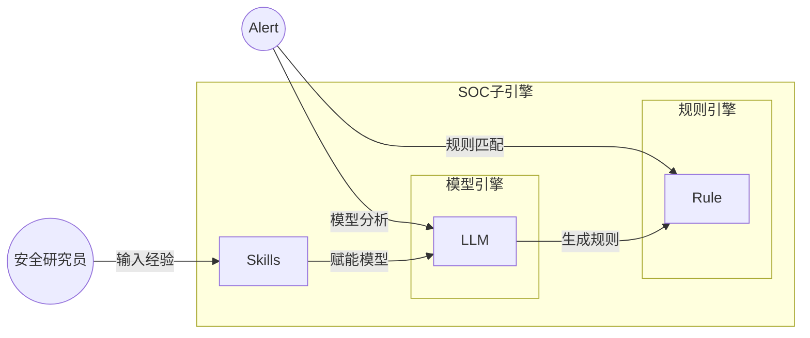

# SOC-Copilot
SOC子引擎，基于agent skills技术，安全研究员可以将自己的检测、研判、调查、响应经验转换成Skills，  
赋能SOC。

## 流程图

```mermaid
graph LR
    Alert((Alert))

    subgraph SOC_Sub_Engine ["SOC子引擎"]
        subgraph Rule_Engine ["规则引擎"]
            Rule[Rule]
        end

        subgraph Model_Engine ["模型引擎"]
            LLM[LLM]
        end

        Skills[Skills]
    end

    Researcher((安全研究员))

    Alert -- "规则匹配" --> Rule
    Alert -- "模型分析" --> LLM
    LLM -- "生成规则" --> Rule
    Skills -- "赋能模型" --> LLM
    Researcher -- "输入经验" --> Skills
```