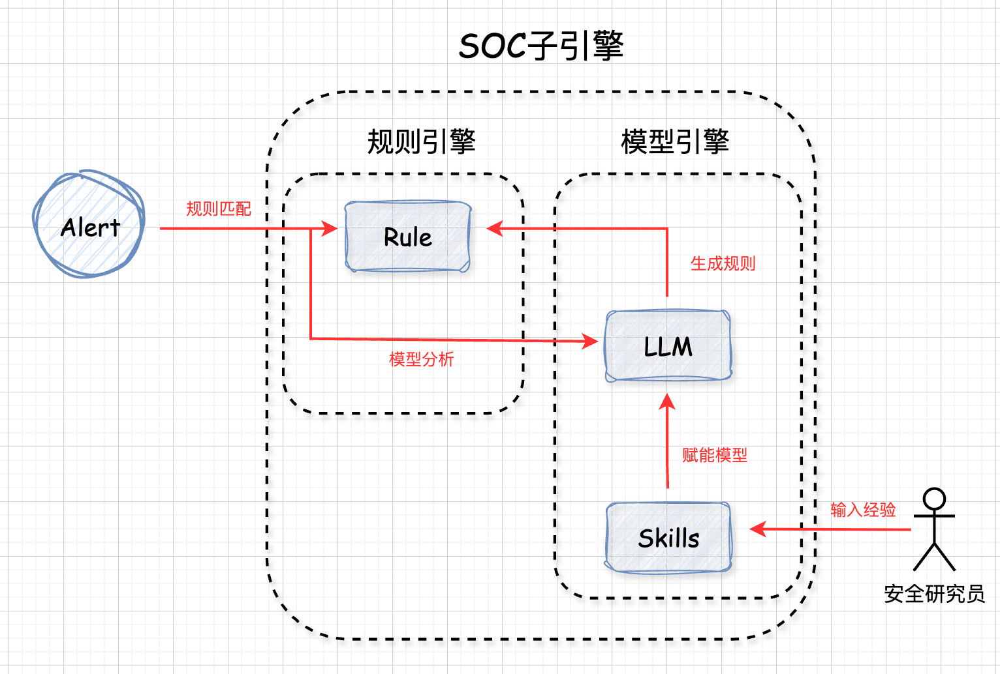
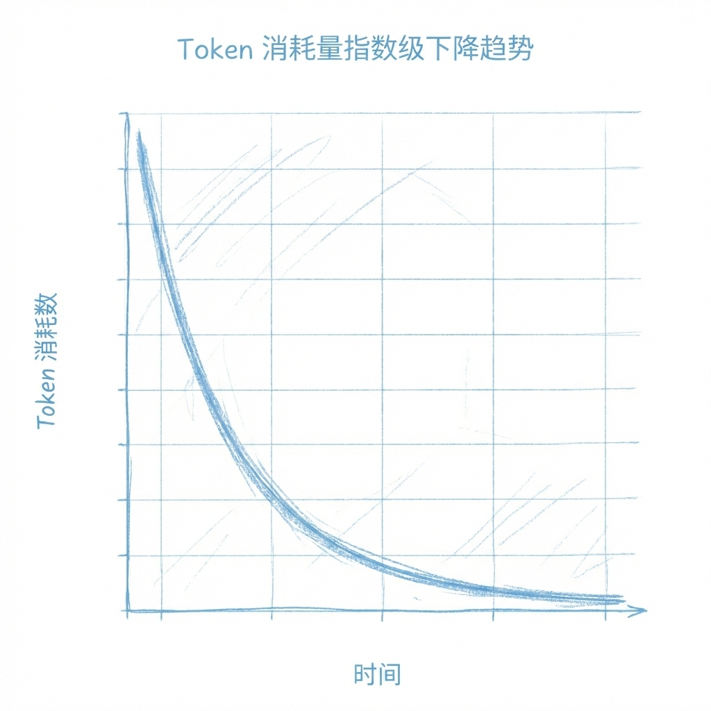

<div align="center">

# SOC-Copilot

**🤖 AI-Powered Security Operations Center Assistant**

[](https://github.com/G4rb3n/SOC-Copilot/stargazers)
[](https://github.com/G4rb3n/SOC-Copilot/network/members)
[](LICENSE)
[](https://github.com/G4rb3n/SOC-Copilot/issues)

**[English](README_EN.md) | 简体中文**

SOC子引擎，基于Agent-Skills技术通过AI赋能SOC平台，对安全告警进行智能研判、深度调查和自动化响应。

`#AgenticSOC` `#NextGenSIEM` `#AICyberSecurity` `#IncidentResponse` `#SecurityAutomation`

</div>

---

## 📖 目录

- [✨ 核心特性](#-核心特性)
- [🏗️ 系统架构](#️-系统架构)
- [🚀 快速开始](#-快速开始)
- [📋 工作流程](#-工作流程)
- [🎯 能力边界](#-能力边界)
- [📸 效果演示](#-效果演示)
- [📁 项目结构](#-项目结构)
- [🤝 贡献指南](#-贡献指南)
- [📄 许可证](#-许可证)
- [🙏 致谢](#-致谢)

---

## ✨ 核心特性

| 特性 | 描述 |
|------|------|
| 🔍 **智能研判** | 基于经验库的告警自动研判，支持规则匹配和AI分析双重模式 |
| 🕵️ **深度调查** | 自动化威胁溯源，关联分析，生成调查脚本 |
| 🛡️ **自动响应** | 智能生成响应脚本（Bash/PowerShell），支持一键处置 |
| 📊 **报告生成** | 自动输出专业分析报告，支持多种格式 |
| 🧠 **自我学习** | 分析结果自动固化为规则，持续提升研判能力 |
| ⚡ **效率提升** | 随着规则积累，算力消耗逐渐降低 |

---

## 🏗️ 系统架构



SOC-Copilot采用创新的**双轨处理机制**：
- **可预测告警** → 规则匹配 → 脚本自动化处置
- **不可预测告警** → 大模型研判 → 生成新规则和脚本 → 用户审核固化



---

## 🚀 快速开始

### 安装

#### 方式一：Claude Code 用户

```bash
# 克隆仓库
git clone https://github.com/G4rb3n/SOC-Copilot.git

# 安装到 Claude Skills 目录
mv SOC-Copilot ~/.claude/skills/
cd ~/.claude/skills/SOC-Copilot
```

#### 方式二：OpenClaw 用户

如果您使用 [OpenClaw](https://github.com/OpenClaw/OpenClaw) 平台：

```bash
# 克隆到 OpenClaw Skills 目录
git clone https://github.com/G4rb3n/SOC-Copilot.git ~/.openclaw/skills/SOC-Copilot
```

> 💡 **提示**：安装后需要开始新会话（运行 `/new`）才能加载技能。

### 使用

```bash
# 启动Claude
claude

# 运行SOC-Copilot
/soc-copilot ./samples/
```

---

## 📋 工作流程

```
┌─────────────┐    ┌─────────────┐    ┌─────────────┐    ┌─────────────┐
│   告警输入   │ -> │   智能研判   │ -> │   深度调查   │ -> │   自动响应   │
└─────────────┘    └─────────────┘    └─────────────┘    └─────────────┘
                          │                  │                  │
                          v                  v                  v
                   ┌─────────────┐    ┌─────────────┐    ┌─────────────┐
                   │  生成研判规则 │    │ 生成调查脚本 │    │ 生成响应脚本 │
                   └─────────────┘    └─────────────┘    └─────────────┘
                          │                  │                  │
                          └──────────────────┴──────────────────┘
                                            │
                                            v
                                    ┌─────────────┐
                                    │  用户审核固化  │
                                    └─────────────┘
```

### 详细流程

1. **研判环节**
   - 从指定目录读取告警日志
   - 通过 `reference/triage/triage.md` 经验库进行研判
   - 生成研判规则并保存到 `scripts/triage_rules/`

2. **调查环节**
   - 调用 `reference/investigation/investigation.md` 进行深度分析
   - 生成Python调查脚本并保存到 `scripts/investigation/`

3. **响应环节**
   - 调用 `reference/incident_response/incident_response.md` 进行处置
   - 生成Bash/PowerShell响应脚本并保存到 `scripts/incident_response/`

4. **报告环节**
   - 根据 `assets/analysis_report.md` 模板输出分析报告
   - 保存到 `reports/` 目录

---

## 🎯 能力边界

> ⚠️ 了解工具的边界，更好地发挥其价值

| ✅ 支持的能力 | ❌ 不支持的能力 |
|-------------|----------------|
| 告警研判分析 | 原始日志检测 |
| 威胁调查溯源 | 海量告警实时处理 |
| 自动化响应处置 | 替代安全分析师 |
| 自学习规则生成 | - |

---

## 📸 效果演示

### 研判环节


### 调查环节


### 响应环节


### 报告环节


---

## 📁 项目结构

```
SOC-Copilot/
├── assets/                 # 模板资源
│   ├── triage_rule.yml     # 研判规则模板
│   └── analysis_report.md  # 分析报告模板
├── reference/              # 经验知识库
│   ├── triage/             # 研判经验
│   │   ├── endpoint/       # 终端安全
│   │   └── network/        # 网络安全
│   ├── investigation/      # 调查经验
│   └── response/           # 响应经验
├── scripts/                # 生成的脚本
│   ├── triage_rules/       # 研判规则
│   ├── investigation/      # 调查脚本
│   └── incident_response/  # 响应脚本
├── samples/                # 示例告警
└── reports/                # 分析报告
```

---

## 🤝 贡献指南

欢迎贡献！请查看 [CONTRIBUTING.md](CONTRIBUTING.md) 了解如何：
- 🐛 报告Bug
- 💡 提出新功能建议
- 📝 改进文档
- 🔧 提交代码

### 添加新的经验知识

您可以主动输入SKILL文件对SOC子引擎进行训练：

1. 在 `reference/` 对应目录下创建经验文档
2. 参考现有格式编写分析经验
3. 提交PR合并到主分支

---

## 📄 许可证

本项目采用 [MIT License](LICENSE) 许可证。

---

## 🙏 致谢

感谢所有贡献者的付出！

---

<div align="center">

**如果这个项目对您有帮助，请给一个 ⭐ Star 支持一下！**

[](https://star-history.com/#G4rb3n/SOC-Copilot&Date)

</div>
